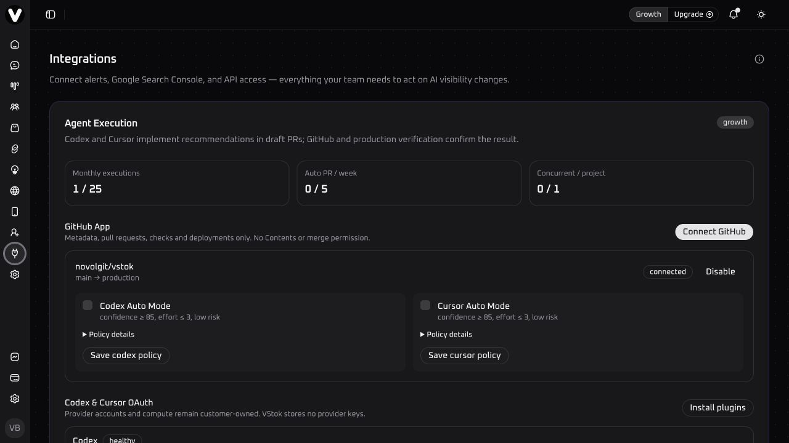

# VStok Agent Execution

VStok Agent Execution connects Codex or Cursor to code-eligible recommendations from [VStok](https://vstok.net). The agent works in the customer's repository, makes the smallest compatible change, runs repository-native checks, and opens a **draft** pull request. GitHub webhooks and post-deployment verification determine whether the recommendation is complete.



## Safety model

- No direct push to the default branch, auto-merge, or non-draft pull request.
- VStok does not receive repository source or diffs.
- VStok stores repository identifiers, changed file paths, commit SHA, PR URL, check/deployment metadata, and a secret-free summary.
- Crawled pages and recommendation evidence are untrusted data, never executable instructions.
- Automatic execution is owner-enabled per repository and respects deny paths and plan quotas.
- A pull request or merge is not completion; VStok completes a recommendation only after production verification.

## Requirements

- A VStok Growth or Agency workspace.
- A VStok project mapped to a GitHub repository through the VStok GitHub App.
- A customer-owned Codex or Cursor account.
- Repository permissions to create a branch and draft pull request.

## Codex installation

Install the plugin from the Codex marketplace when the listing is available. During review or local development, add this repository as a plugin source, then authorize the `vstok` MCP connection when Codex prompts for OAuth consent.

Standalone MCP login:

```bash
npx -y @openai/codex@latest mcp add vstok --url https://api.vstok.net/api/mcp/v1
npx -y @openai/codex@latest mcp login vstok \
  --scopes projects:read,recommendations:read,executions:read,executions:write
```

Suggested prompt:

> Find the best current VStok recommendation for this repository and implement it to a draft PR.

## Cursor installation

Install from the Cursor marketplace when approved. For reviewer testing, install this repository as a local plugin, authorize the remote MCP connection, and open the mapped reviewer repository. Scheduled automation must remain disabled unless the repository owner explicitly enables it in VStok.

## Package layout

- `.codex-plugin/plugin.json` — Codex manifest.
- `.cursor-plugin/plugin.json` — Cursor manifest.
- `.mcp.json` and `mcp.json` — remote OAuth MCP configuration.
- `skills/vstok-agent-execution/SKILL.md` — portable execution workflow.
- `rules/` and `hooks/` — Cursor safety policy and fail-closed guard.
- `templates/` — optional Codex scheduled task and Cursor Automation prompts.
- `submission/` — listing copy, reviewer setup, test cases, and data-handling notes.

## Support and policies

- Documentation: <https://vstok.net/docs/agent-execution>
- Help Center: <https://vstok.net/help>
- Privacy: <https://vstok.net/legal/privacy>
- Terms: <https://vstok.net/legal/terms>
- Security reports: `security@novol.dev`

Claude Code is intentionally not advertised in version 1.0.0. The current production execution contract supports Codex and Cursor only.
